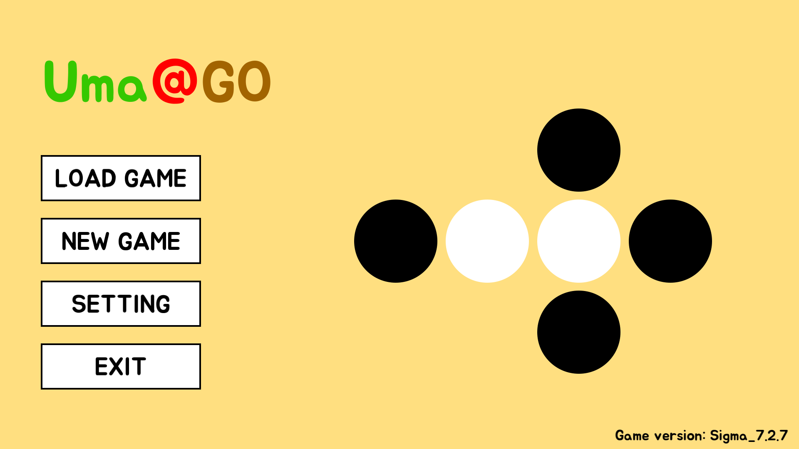
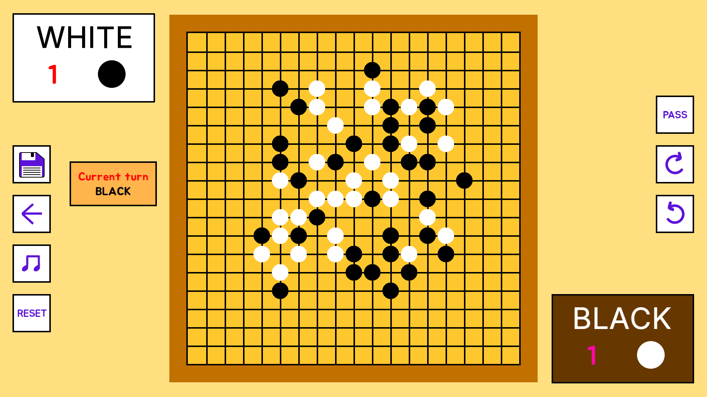
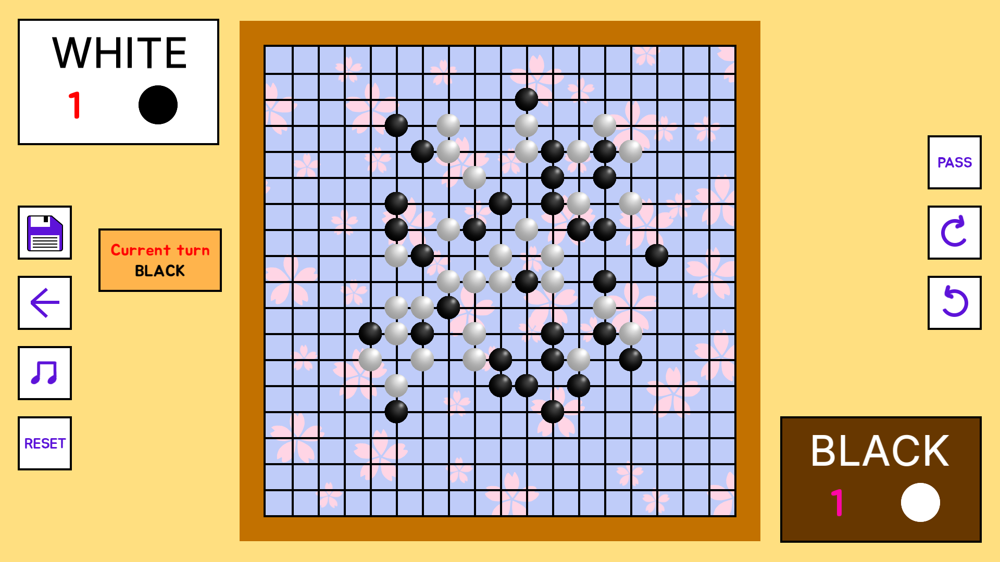
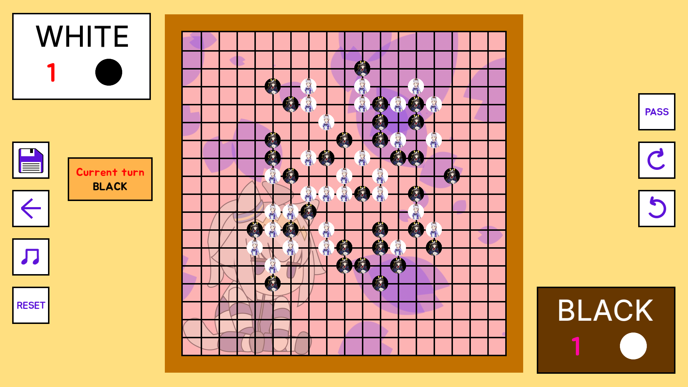

Version: Sigma_7.2.7.

This is a Go game with Japanese ruleset recreation using C++.

## Instruction
Currently, the game needs C++ and its library in PATH environment variable to correctly link to the .dll files.

Run game.exe file to play.

## File tree

```bash
go-game/
 ┣ data
 ┃ ┣ config.json
 ┃ ┗ saved_game.json
 ┣ font
 ┃ ┣ Inter.ttf
 ┃ ┗ Jua-Regular.ttf
 ┣ include
 ┃ ┣ AI.h
 ┃ ┣ board.h
 ┃ ┣ config_handler.h
 ┃ ┣ custom_util.h
 ┃ ┣ game_handler.h
 ┃ ┣ game_logic.h
 ┃ ┣ game_scoring.h
 ┃ ┣ test.h
 ┃ ┣ UI_element.h
 ┃ ┣ UI_Renderer.h
 ┃ ┗ zobrist_hash.h
 ┣ lib/
 ┃ ┗ json.hpp
 ┣ src
 ┃ ┣ AI.cpp
 ┃ ┣ board.cpp
 ┃ ┣ config_handler.cpp
 ┃ ┣ game_handler.cpp
 ┃ ┣ game_logic.cpp
 ┃ ┣ game_scoring.cpp
 ┃ ┣ main.cpp
 ┃ ┣ test.cpp
 ┃ ┣ UI_element.cpp
 ┃ ┣ UI_Renderer.cpp
 ┃ ┗ zobrist_hash.cpp
 ┣ assets
 ┃ ┣ audio
 ┃ ┃ ┣ sfx
 ┃ ┃ ┃ ┣ gamefinish.wav
 ┃ ┃ ┃ ┣ kothreat.wav
 ┃ ┃ ┃ ┣ menuclick.wav
 ┃ ┃ ┃ ┣ saveclick.wav
 ┃ ┃ ┃ ┣ stonecapture.wav
 ┃ ┃ ┃ ┣ theme_1_stoneplace.wav
 ┃ ┃ ┃ ┣ theme_2_stoneplace.wav
 ┃ ┃ ┃ ┣ theme_3_stoneplace_black.wav
 ┃ ┃ ┃ ┗ theme_3_stoneplace_white.wav
 ┃ ┃ ┗ song
 ┃ ┃ ┃ ┣ note.txt
 ┃ ┃ ┃ ┣ song_1.mp3
 ┃ ┃ ┃ ┣ song_2.mp3
 ┃ ┃ ┃ ┗ song_3.mp3
 ┃ ┣ board_background
 ┃ ┃ ┣ theme_1.png
 ┃ ┃ ┣ theme_2.png
 ┃ ┃ ┗ theme_3.png
 ┃ ┣ gameplay_buttons
 ┃ ┃ ┣ back.png
 ┃ ┃ ┣ music_off.png
 ┃ ┃ ┣ music_on.png
 ┃ ┃ ┣ pass.png
 ┃ ┃ ┣ redo.png
 ┃ ┃ ┣ reset.png
 ┃ ┃ ┣ save.png
 ┃ ┃ ┗ undo.png
 ┃ ┣ stones
 ┃ ┃ ┣ theme_1_black_stone.png
 ┃ ┃ ┣ theme_1_white_stone.png
 ┃ ┃ ┣ theme_2_black_stone.png
 ┃ ┃ ┣ theme_2_white_stone.png
 ┃ ┃ ┣ theme_3_black_stone.png
 ┃ ┃ ┗ theme_3_white_stone.png
 ┃ ┣ 2_players.png
 ┃ ┣ easy.png
 ┃ ┣ game_title.png
 ┃ ┣ hard.png
 ┃ ┣ indicator.png
 ┃ ┣ normal.png
 ┃ ┗ vs_computer.png
 ┣ Makefile
 ┗ README.md
```
## Gameplay Preview
Main menu:

Theme 1:

Theme 2:

Theme 3:


## Build
- Make use you have `makefile` to build.

- Change the SFML path (`CFLAGS` and `LDFLAGS`) before build.

- Run `make` (or `make all`) to build

## Makefile Example
```bash
CXX = g++
CXXFLAGS = -std=c++17 -Iinclude -I[SFML-PATH]\include -DSFML_STATIC -static -static-libgcc -static-libstdc++
LDFLAGS = -L[SFML-PATH]\lib
LIBS = -lsfml-graphics-s -lsfml-window-s -lsfml-system-s -lsfml-audio-s -lopengl32 -lfreetype -ljpeg -lwinmm -lgdi32 -lws2_32 -lopenal -lvorbis -lsfml-system -lflac -lvorbisenc -lvorbisfile -lvorbis -logg 

SRC = $(wildcard src/*.cpp)
OBJ = $(SRC:.cpp=.o)
TARGET := game.exe

all: $(TARGET)

$(TARGET): $(OBJ)
	$(CXX) $(OBJ) $(LDFLAGS) $(LIBS) -o $(TARGET)

%.o: %.cpp
	$(CXX) $(CXXFLAGS) -c $< -o $@

clean:
	rm -f src/*.o $(TARGET) $(TEST_TARGET)
```

## Technology Stack
- Language: C++
  - Compiler: g++ (Rev8, Built by MSYS2 project) 15.2.0.
  - Build system: Makefile.

- Graphic: SFML 3.0.2.

- AI:
  - Random.
  - Minimax.
  - Minimax + Alpha-Beta Pruning.

## Credit
- [JSON for Modern C++ by nlohmann](https://json.nlohmann.me/)

- Background music:
  - Song 1: Himeko's Theme - Narcissu 1st and Side 2nd OST.
  - Song 2: ミツキヨ (Mitsukiyo) - おかえりトロイメへ.
  - Song 3: re:plus - Solitude.

- Theme 3 used image and sound effect references from the game [Umamusume: Pretty Derby](https://umamusume.com/), all copyrights belong to Cygames, Inc.